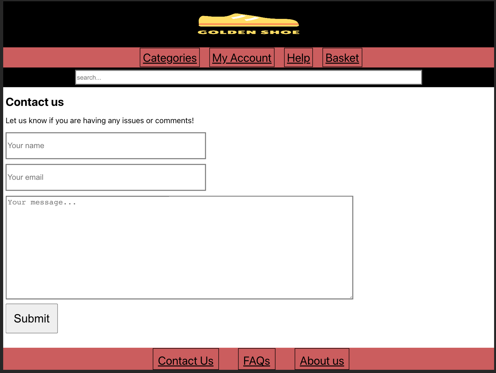
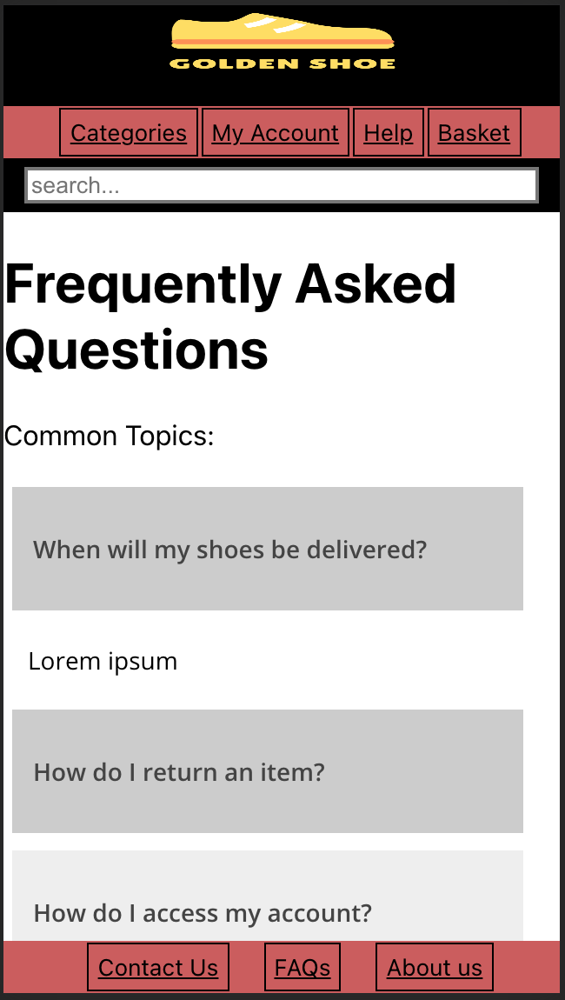

# Golden Shoe

This is a project demo for the 'Golden Shoe' company case study.

## Project information:

This product demo was developed as part of the AND digital interviewing process whereby I have developed a quick demo and presentation for this case study:
[Golden Shoe case study](https://docs.google.com/document/d/1NWRNUvYCiXt4BHVFJ9hkyaLlp7LSMraKB3AERKTQCwg/edit)

This project was developed using Javascript and React.
This project was bootstrapped with [Create React App](https://github.com/facebook/create-react-app).

## Instructions:

#### To clone this repository run:

```
git clone git@github.com:RTurney/GoldenShoe.git
```

In your command line terminal.

#### To run this app, simply run:

```
yarn start
```

In your command line terminal.
This will run the website on your local device and can be accessed at [localhost:3000](http://localhost:3000/) in the browser of your choosing.

## Features implemented:

At it's current implication, this application has 3 pages: main page, 'contact us' page and a FAQs page.

The main page is responsive to different screen sizes:

#### Desktop:


#### Ipad:


#### Ipad rotated:


#### Mobile:


The contact form page requires that users include their name, email address and a message before being submitted.
When a message is submitted, it is sent directly to r.turney93@gmail.com utilising EmailJS.
If a message was successful the user will get a confirmation message, however if the message does not work, the user will be notified.

Again this page is responsive to separate screen sizes:

#### Mobile:


#### Ipad:



The FAQ page has collapsable divs which allow users to open and close solutions that you don't need.
Again like all other pages, this was built 'mobile first' and is responsive to the screen size.

#### Ipad:


#### Mobile:




## User stories:

```
As a customer,
So that I know I am on the right website,
I should see the 'Golden shoe' displayed on the page.
```

```
As a customer,
So that I can navigate the website,
I should be able to use the navbar on any page.
```

```
As a customer,
So that I can use this website on my phone,
The website should be rendered correctly on mobile devices.
```

```
As a customer,
So that I can use this website on my ipad,
The website should be rendered correctly on tablet devices.
```

```
As a customer,
So that I can get ahold of someone from the Golden Shoe,
I would like to be able to access a contact page.
```

```
As a customer,
So that I can specifically state what my issue is,
I would like to be able to send a message.
```

```
As a customer,
So that the customer service team can email me back,
I would like to be able to send them my email address.
```

```
As a customer,
So that I can be addressed properly,
I would like to be able to send my name.
```

```
As a member of the customer service team,
So that I can hear from our customers,
I would like to receive an email with the details of the customer's issues.
```

```
As a customer,
So that I can find all the information I need,
I would like to be able to access a FAQ page.
```

```
As a customer,
So that I only see the solution I need,
I would like to be able to collapse FAQs I don't need.
```

## Wireframes:

#### Home page:


This will be the home page of the website. It will be accessible by clicking on the 'Golden shoe' icon in the top left corner of the page anywhere from the website.
On this page is the navbar and the footer, which will be the same and accessible from every part of the website. Clicking on any of the icons should send you to that part of the website.
The main body of this page will be a product image with two buttons, one will take you to the men's section and the other will take you to the women's section.

Like all other pages of the website, this page will be responsive to a screen's resolution and will change accordingly, as shown below:


#### Contact form:


This will be the contact form page of the website.
A user should be able to fill out their name and email address and then leave a message as to what they are contacting the company about.
All sections of this form are required.
Upon submission, the user should be taken to a page saying that a Golden Shoe employee will respond to them as soon as they are able. An email should be sent out upon a user clicking the submission form.

#### Product page:


This will be the standard template for each product page.
There will be a large image in the middle of the product, as well as smaller, additional images on the left hand side of the product.
Clicking on the smaller images will put them in the larger image slot.
On the right hand side is the Product name, its price, its colour and whether or not the product is in stock.
There is also a dropdown box for choosing the product size. This will be a required feature before adding it to the basket.
There is also a drop down box for additional information. I have done this to save space on the page and minimise unnecessary details for the user.
The product can be added to the basket by using the `Add to basket` button at the bottom of the page.

Additionally like all other pages of the website, this one will be redesigned for mobile users as well. As shown below:


This will require the page being scrollable.

#### Basket:

The basket feature should be accessible from any part of the website as an overlay that will appear under the basket button as demonstrated below:


Here the basket will display all current items in the user's basket as well as their quantity and total price, as demonstrated below:


The user can click on the `Checkout` button to get taken to the checkout page.
The user can also increase or remove item's from their basket easily using the `+` or `-` buttons in the basket overlay.
This design is used to reduce the amount of pages needed during a user's shopping experience as well as the number of button presses between the homepage and completing a transaction.

#### FAQs page:


This page will contain a number of answers to frequently asked questions.
The page is designed so that questions are grouped into different sections and upon clicking on the drop down menu, a list of frequently asked questions as well as their answers will be shown.
This page will be implemented to reduce the number of customers needing to use the customer contact form as well as the customer helpline. This should also hopefully provide a better and clearer user experience for customer's using this website.
The search bar will try to provide FAQ results for any question or topic typed in by the user.

## Testing:

To run tests enter `yarn test` into the command line.
This will run through all tests for this application.

Unfortunately due to time constraints and a lack of knowledge in end-to-end testing for React, this application was not built through Test-driven development.

## Developer notes:

I should build this application using test-driven development, however due to time constraints and limited experience with React, I may have to just build the project as I go.

1. First step for this application will be to build the main home page for this website.
   What I will want to do from there is build this website 'mobile-first' so that the website works will on both Mobile, Ipad and Desktop.

So in order to do that I will need:

- [x] Someone should be able to access the main page
- [x] Navigation bar
- [x] Searchbar
- [x] Footer component
- [x] Main body of the website
- [x] Ensure all components are accessible and look good on either mobile or desktop

2. Second step will be to have a contact form for users to contact Golden Shoe

- [x] New page accessible through the navbar/footer of the main page
- [x] Will need a user name input
- [x] Will need email input
- [x] Will need a text input field
- [x] Need a submit button
- [x] Will need all the above text fields to be required for the submit button to work
- [x] Will need a confirmation that message was sent
- [x] Should have an email sent to my own email address using the form with all the details above, to emulate how it would work in the business setting.
- [x] Looks good across multiple screen sizes

3. Final step before I run out of time will be to enact an FAQs page:

- [x] New page accessible by footer
- [x] Each topic has drop down menu
- [x] Drop down menu pushed the rest of the page down
- [x] Each drop down menu will have text/ solutions
- [x] Looks good across multiple screen sizes

### Author

email: r.turney93@gmail.com

github: https://github.com/RTurney

linkedin: https://www.linkedin.com/in/richard-turney-4ab178113/
